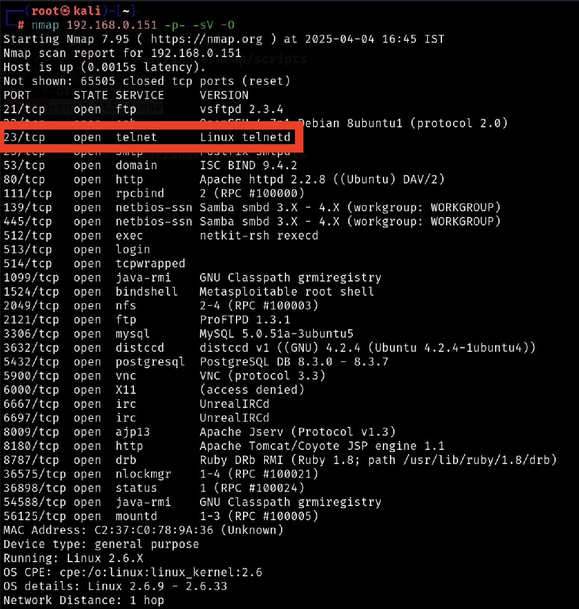
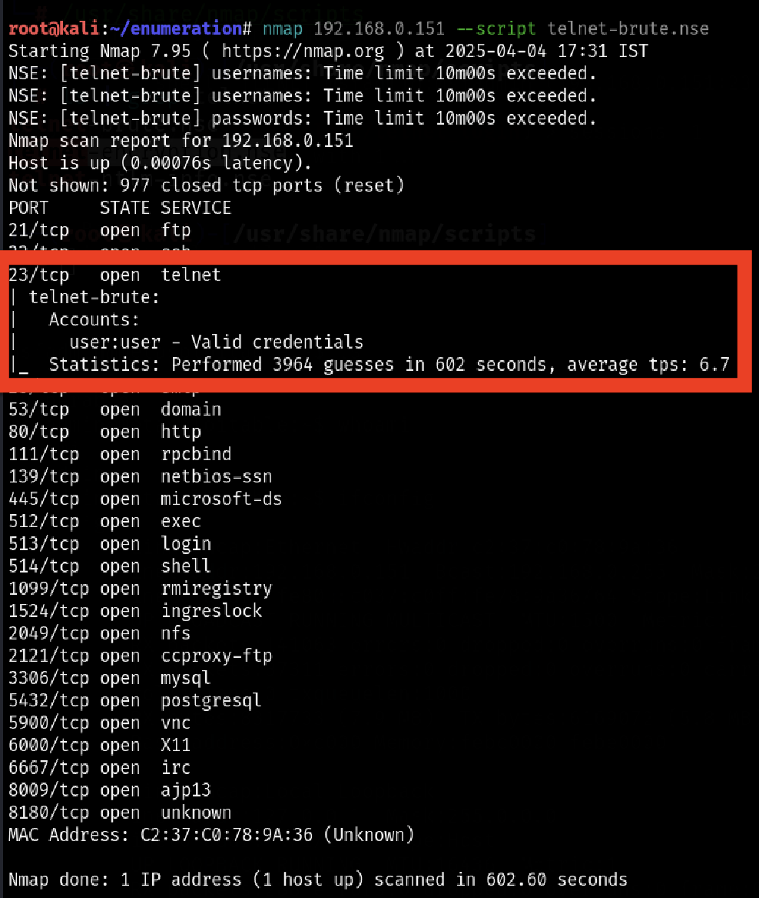

# Telnet Login Vulnerability – Case Study

## Overview
This case study documents the identification and analysis of an insecure
Telnet service discovered during network reconnaissance in a controlled
lab environment.

The objective was to assess the security risk posed by legacy services
using plaintext authentication mechanisms.

## Environment
- Target type: Lab / intentionally vulnerable system
- Network type: Isolated test environment
- Operating system: Linux (Metasploitable-style target)

## Methodology
The assessment followed a structured approach:
1. Network reconnaissance and service discovery
2. Identification of exposed services
3. Authentication weakness analysis

## Key Findings
- Telnet service (TCP port 23) was exposed to the network
- Authentication was performed in plaintext
- Weak credentials allowed unauthorized access
- Lack of access controls increased attack surface

## Supporting Evidence

Initial reconnaissance confirmed that the target host was reachable
within the isolated lab environment.

Service enumeration identified TCP port 23 (Telnet) as open, indicating
the presence of a legacy plaintext remote access service.

The service banner confirms that the Telnet daemon was active on the
system, increasing exposure to credential interception and
unauthorized access.

## Risk Analysis
An exposed Telnet service introduces the following risks:
- Credential interception via network sniffing
- Unauthorized remote access
- Potential lateral movement
- Compliance and security policy violations

Overall Risk Rating: **High**

## Recommendations
- Disable Telnet service entirely
- Replace Telnet with SSH using key-based authentication
- Restrict remote access using firewall rules
- Enforce strong authentication policies
- Monitor for unauthorized login attempts

## Conclusion
This assessment highlights the continued risk posed by legacy services
in modern environments. Removing insecure protocols and enforcing
secure remote access mechanisms significantly reduces attack surface.

> All testing was performed in a controlled lab environment for
educational and defensive security purposes only.

