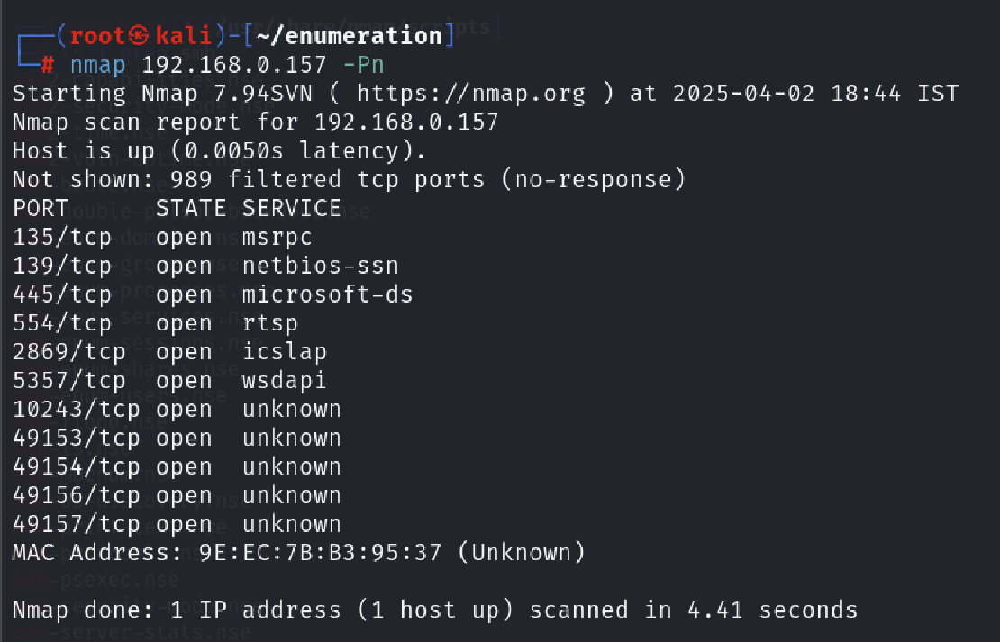
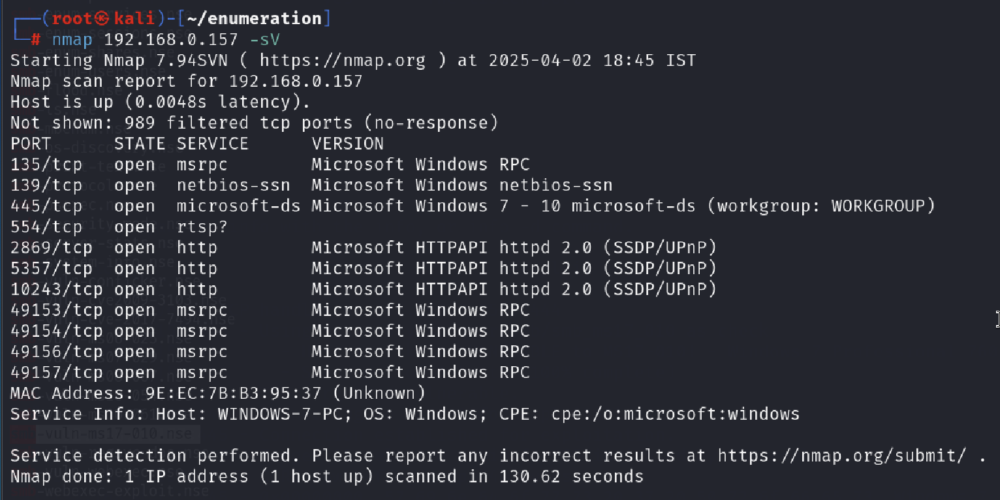
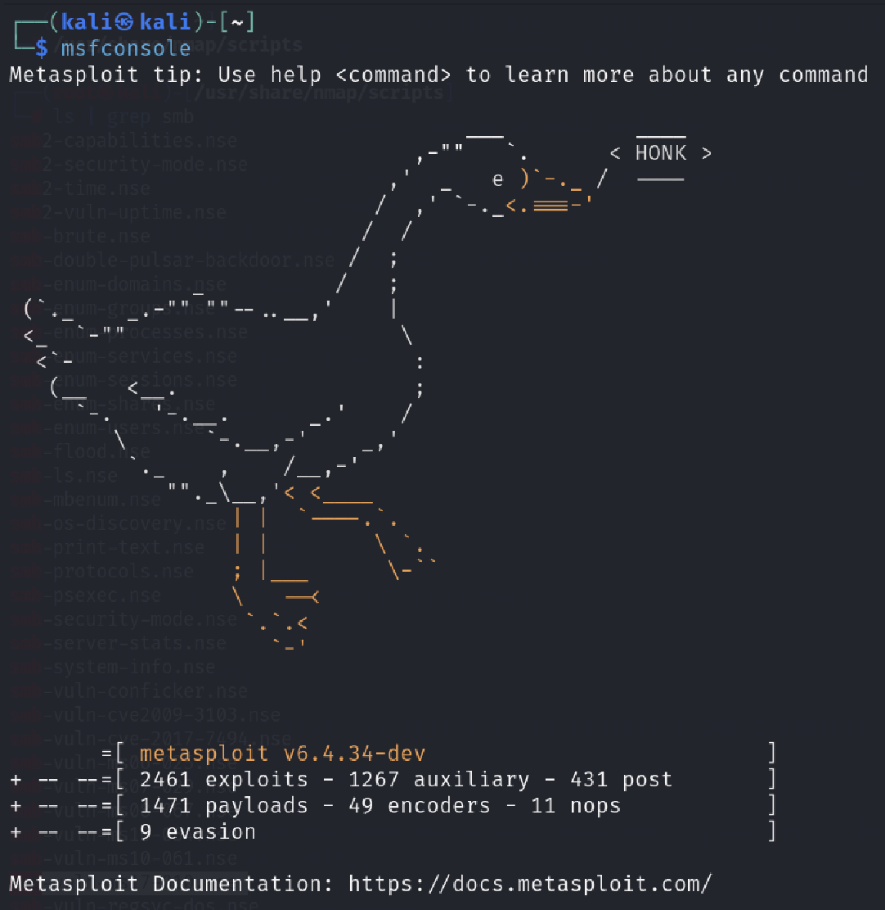
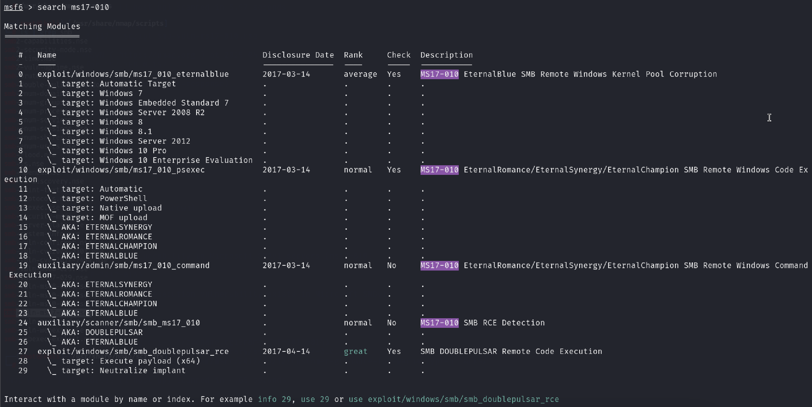
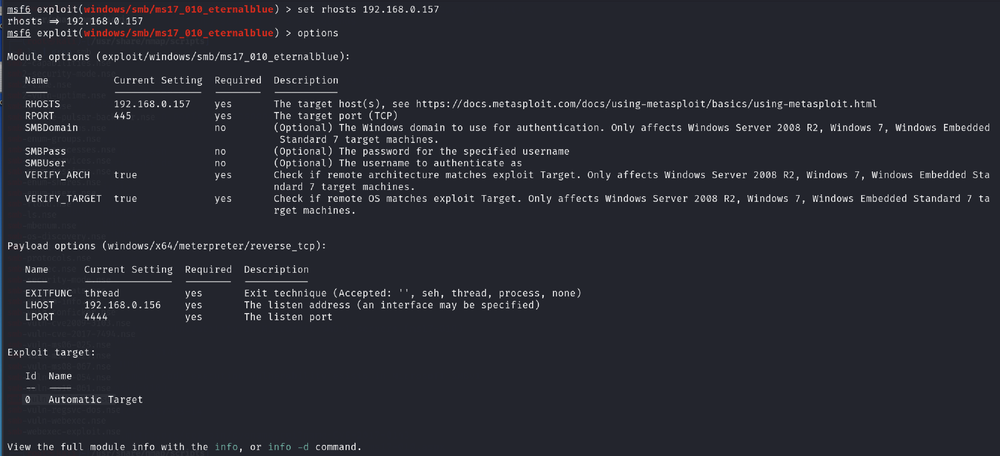
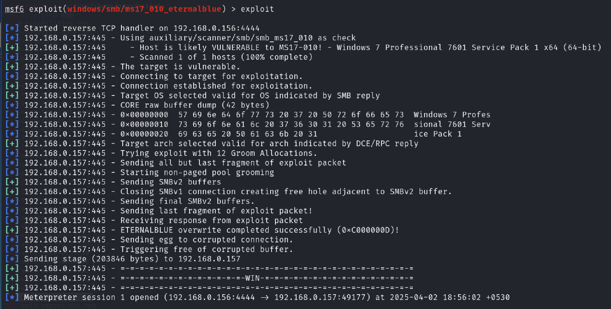
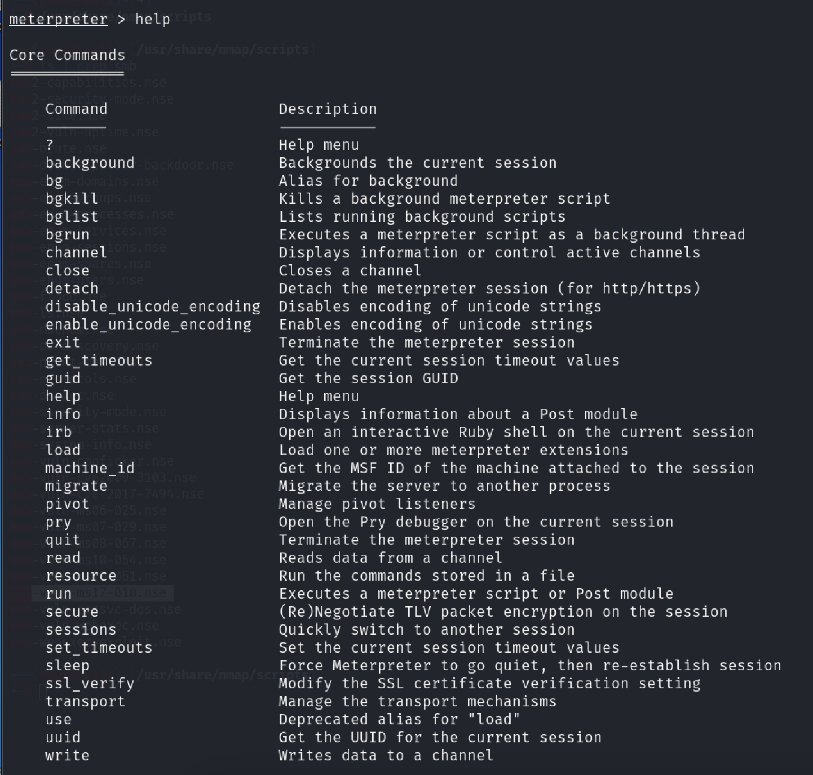
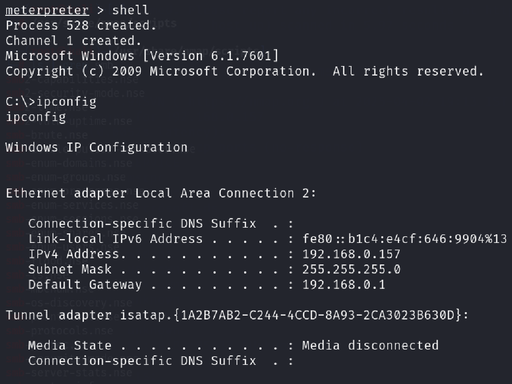

# Windows 7 MS17-010 (EternalBlue) Vulnerability – Case Study

## Overview

This case study documents the identification, validation, and risk assessment of the MS17-010 (EternalBlue) vulnerability on a Windows 7 system within a controlled lab environment.

The objective was to assess the security impact of an unpatched SMB service and demonstrate how legacy vulnerabilities can lead to remote code execution.

## Environment

- Target type: Windows 7 laboratory machine
- Network type: Isolated test environment
- Vulnerability: MS17-010 (EternalBlue)
- Protocol: SMB (TCP Port 445)

## Methodology

1. Host discovery and service enumeration
2. SMB version identification
3. MS17-010 vulnerability verification
4. Controlled exploitation in a lab environment
5. Risk evaluation and remediation assessment

## Key Findings

- SMB service (TCP Port 445) was accessible
- Target system was vulnerable to MS17-010 (EternalBlue)
- Successful controlled exploitation demonstrated the impact of missing security updates
- Remote code execution was possible on the unpatched system

## Supporting Evidence

### 1. Host Discovery

### 2. Service Version Detection

### 3. MS17-010 Vulnerability Verification

### 4. Metasploit Console Startup

### 5. MS17-010 Module Search

### 6. Module Configuration

### 7. Target Configuration

### 8. Successful Controlled Exploitation

### 9. Meterpreter Session

### 10. Post-Exploitation Verification

