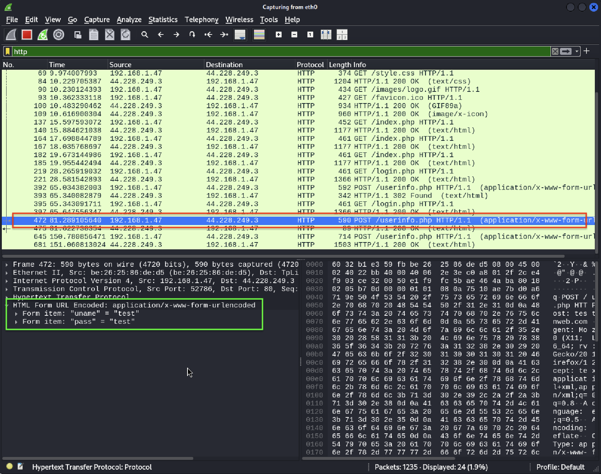
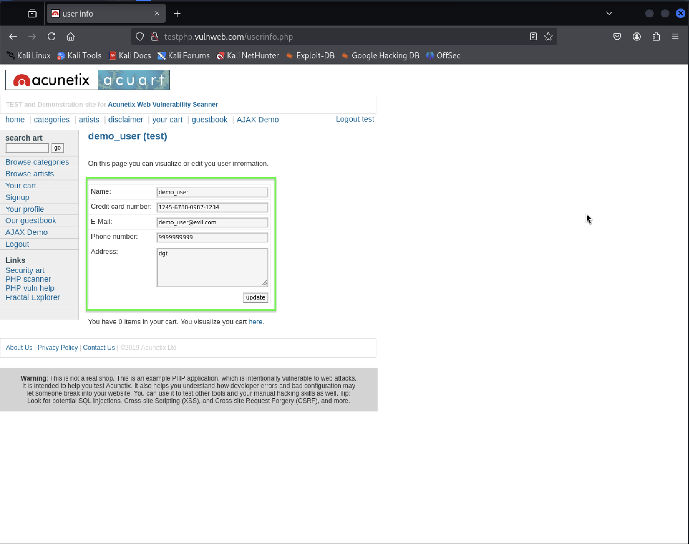

# HTTP Plaintext Credential Exposure Analysis

## Overview
This analysis demonstrates how sensitive user information is transmitted
in plaintext over HTTP, making it vulnerable to interception by any
attacker with network access.

The assessment was conducted in a controlled lab environment for
educational and defensive security purposes only.

---

## Environment
- Tool Used: Wireshark
- Interface: eth0
- Protocol Analyzed: HTTP
- Target Application: testphp.vulnweb.com
- Network Type: Local lab network

---

## Attack Scenario
An attacker positioned on the same network can capture HTTP traffic
and inspect unencrypted POST requests. Since HTTP does not provide
transport-layer encryption, sensitive fields are transmitted in cleartext.

---

## Evidence of Plaintext Data Exposure

### 1. Captured HTTP POST Request

The screenshot shows an HTTP POST request to `/userinfo.php`
using the `application/x-www-form-urlencoded` content type.

---

### 2. Extracted Sensitive Fields

Wireshark reveals multiple sensitive fields directly in plaintext,
including:
- Username
- Email address
- Phone number
- Credit card number
- Physical address

This data can be read without decryption or special privileges.

---

### 3. Application-Level Confirmation

The captured traffic directly correlates with the data entered
into the web application form, confirming real-world exposure.

---

## Impact Assessment
- Exposure of personally identifiable information (PII)
- Risk of credential theft and identity fraud
- Violation of secure transmission standards
- Non-compliance with security best practices (e.g., OWASP A02:2021)

---

## Mitigation Recommendations
- Enforce HTTPS using TLS encryption
- Redirect all HTTP traffic to HTTPS
- Implement HSTS headers
- Avoid transmitting sensitive data without encryption
- Regularly monitor network traffic for plaintext protocols

---

## Conclusion
This analysis highlights the critical risk of transmitting sensitive
information over HTTP. Without encryption, attackers can easily
intercept and misuse user data, emphasizing the necessity of HTTPS
for all authentication and data submission endpoints.
